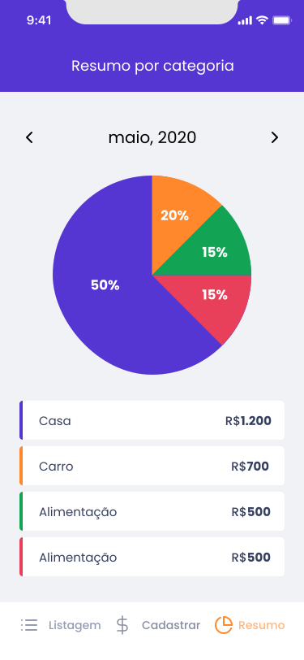

<p align="center">
  
</p>

<p align="center">
  
       
  
</p>

<br />

<p align="center">
  
  
  
  
</p>

# Ignite Project
Simple app to control your monetary consume, registering income and outcome

## 🔨 Features

→ Social Login with OAuth2 using ([**Expo Authentication**](https://docs.expo.dev/guides/authentication))

→ Save and get saved records using [**Async Storage**](https://docs.expo.dev/versions/latest/sdk/async-storage)

→ Form with [**React Hook Form**](https://react-hook-form.com)

→ Form fields validation using [**Yup**](https://www.npmjs.com/package/yup)

→ Global Style using [**Styled Components**](https://styled-components.com)

## 🚀 Techs & Tools
→ [**React Native**](https://reactnative.dev)

→ [**React Navigation**](https://reactnavigation.org)

→ [**Expo Bare Workflow**](https://docs.expo.dev/bare/exploring-bare-workflow)

→ [**TypeScript**](https://www.typescriptlang.org)

→ [**Styled Components**](https://styled-components.com)

## 📄 Documentation
Instructions to be able to create all the necessary environment to run the application

> Create a .env file and add the requested environment variables based on the .env.example file in the project root

## 💻 Run project
```bash
# Open terminal and clone this repository
$ git clone https://github.com/Sup3r-Us3r/ignite-project-gofinances-mobile.git

# Install the command line tools
$ npm install --global expo-cli
# or
$ yarn add global expo-cli

# Install dependencies
$ npm install
# or
$ yarn install

# Start the application
$ expo start
```
